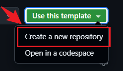
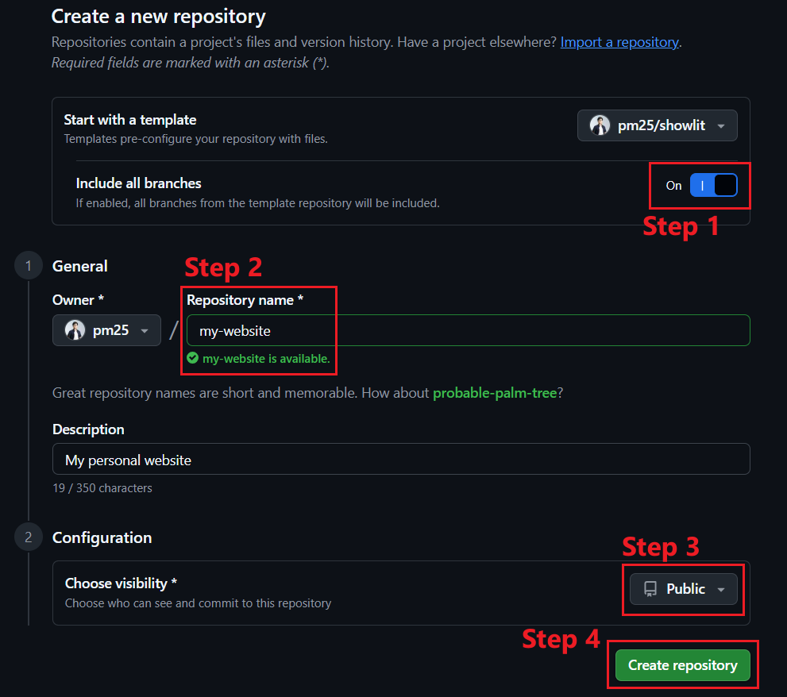
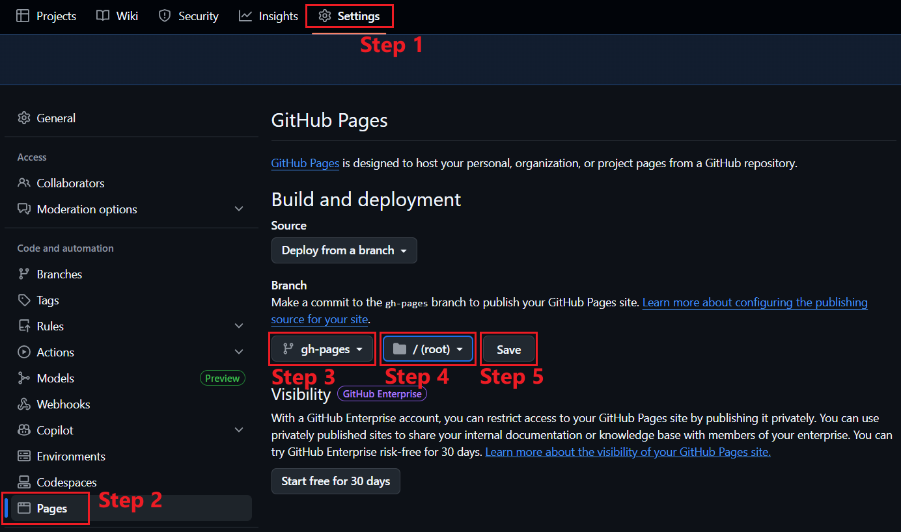

# 🚀 Quick Setup Guide – natasharadika

This guide shows how to get your **natasharadika website up and running quickly**, without any local development. Simply update the configuration files → commit → push. GitHub Actions will handle the build and deployment automatically.

---

### 1️⃣ Create your repository

Click **"Use this template"** → **"Create a new repository"**.



On the **Create a new repository** page:

1. Enable **"Include all branches"**
2. Enter a repository name
3. Set the visibility to **Public**
4. Click **"Create repository"**



---

### 2️⃣ Enable GitHub Pages

Go to your **Repository Settings** → **Pages**, then configure:

- **Branch:** gh-pages
- **Folder:** /(root)

Click **Save**.

&nbsp;

---

### 3️⃣ Update configuration files in `/config`:

- [`site.yaml`](/config/site.yaml) — website title, metadata, etc.
- [`profile.yaml`](/config/profile.yaml) — your name, email, profile image, etc.
- [`publications.yaml`](/config/publications.yaml) — (optional) research publications list

---

### 4️⃣ Commit and push changes to `main` branch

Once your changes are pushed (or merged) to `main` branch, GitHub Actions will automatically:

- Build the project
- Deploy to GitHub Pages
- Publish your website 🎉

After a few minutes, your website will be available at:

```sh
https://<your-github-username>.github.io/<your-repo-name>
```

> 💡Tip: Any future changes pushed to main will automatically update your live website.
